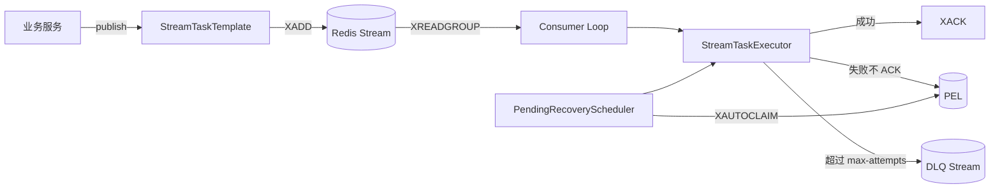

# StreamTask 架构说明

StreamTask 是一个独立的 Spring Boot Starter 项目，不依赖 Atlas 后端。

## 核心链路

## Redis Key

- 主流：`stream-task:{namespace}:main`
- 死信流：`stream-task:{namespace}:dlq`
- 重试计数：`stream-task:{namespace}:attempts`
- 最近错误：`stream-task:{namespace}:last-error`
- 幂等状态：`stream-task:{namespace}:idem:{taskType}:{businessKey}`

## 可靠性边界

组件提供至少一次投递语义，不承诺严格 Exactly-Once。业务数据库仍应使用唯一索引、状态机条件更新或幂等写入接口兜底。
